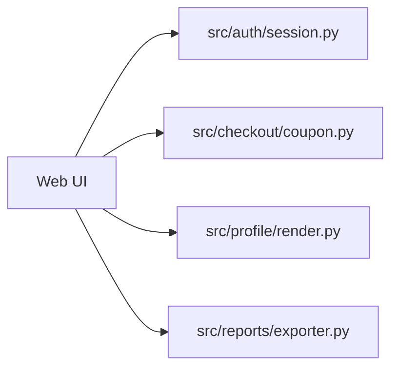

# CTSE Buggy Shop Architecture

## Overview

This mini app simulates a commerce backend with known defects for triage experiments.

## Known Weak Areas

- `session.py`: refresh/session logic can cause unexpected timeout behavior.
- `coupon.py`: discount flow currently does not apply the coupon reduction.
- `exporter.py`: SQL builder is unsafe and can produce broken queries.
- `render.py`: profile rendering is not escaped and can allow stored script execution.
